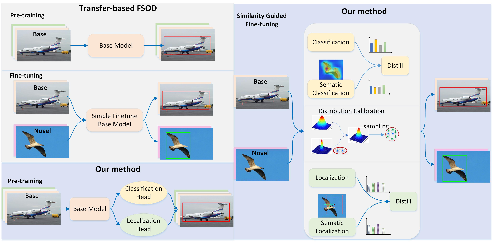
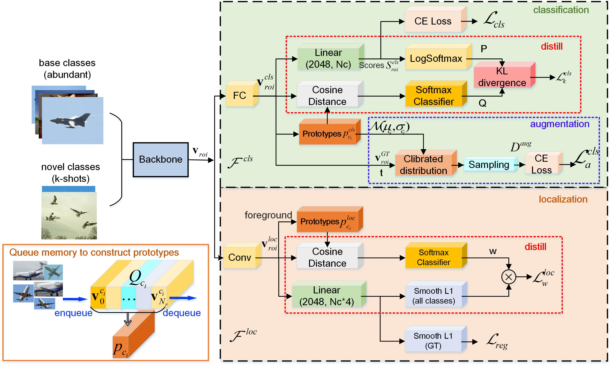

# Exploiting more Transferable Knowledge for Few-Shot Object Detection

## Requirements

Python == 3.8.10

Pytorch == 1.7.1

Torchvision == 0.8.2

Detectron2 == 0.3

CUDA == 10.1

## Conceptual Ideas



## Overview of Model Architecture



## Datasets

COCO: https://cocodataset.org/#download;
PASCAL VOC: http://host.robots.ox.ac.uk/pascal/VOC/;
DsLMF+: https://pan.baidu.com/s/1nsoEA1MsOxjtUrbVfc9PaQ?pwd=1111
CUMT-BelT: https://pan.baidu.com/s/1AJsjkPqXjkIJY8KQQdKfcw?pwd=z39g

## Datasets structure

```
    ├── datasets/
        ├── coco/     
        │   ├── annotations/
        │   ├── train2014/
        │   └── val2014/
        ├── cocosplit/
        ├── VOC2007/      
        │   ├── Annotations/
        │   ├── ImageSets/
        │   └── JPEGImages/
        ├── VOC2012/      
        │   ├── Annotations/
        │   ├── ImageSets/
        │   └── JPEGImages/
        ├── vocsplit/
        ├── CoalMine/      
        │   ├── Annotations/
        │   ├── train/
        │   └── val/
        ├── coalsplit/
        ├── Foreign/      
        │   ├── Annotations/
        │   ├── train/
        │   └── val/
        └── foreignsplit/
```

## Training and Evaluation

* For VOC

```
sh voc_train.sh emtk SPLIT_ID
```

* For COCO

```
sh coco_train.sh emtk
```

This repo is built upon [DeFRCN](https://github.com/er-muyue/DeFRCN), where you can download the datasets and [MFDC](https://github.com/shuangw98/MFDC).
